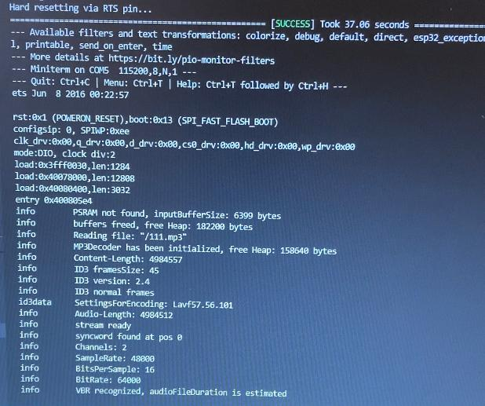

# PRACTICA 7:Buses de comunicación III (I2S)

## Parte 2: reproducir un archivo WAVE en ESP32 desde una tarjeta SD externa

## Codigo:
```cpp
#include <Arduino.h>

#include "WiFi.h"
#include "Audio.h"
#include "SD.h"
#include "FS.h"

// Digital I/O used
#define SD_CS          5
#define SPI_MOSI      23
#define SPI_MISO      19
#define SPI_SCK       18
#define I2S_DOUT      25
#define I2S_BCLK      27
#define I2S_LRC       26

Audio audio;

String ssid = "Xiaomi_11T_Pro";
String password = "f5cbd8a82232";

void setup() {
    pinMode(SD_CS, OUTPUT);      digitalWrite(SD_CS, HIGH);
    SPI.begin(SPI_SCK, SPI_MISO, SPI_MOSI);
    Serial.begin(115200);
    SD.begin(SD_CS);
    WiFi.disconnect();
    WiFi.mode(WIFI_STA);
    WiFi.begin(ssid.c_str(), password.c_str());
    while (WiFi.status() != WL_CONNECTED) delay(1500);
    audio.setPinout(I2S_BCLK, I2S_LRC, I2S_DOUT);
    audio.setVolume(21); // 0...21

   audio.connecttoFS(SD, "/superhyper.wav");
//  audio.connecttohost("http://www.wdr.de/wdrlive/media/einslive.m3u");
//    audio.connecttohost("http://macslons-irish-pub-radio.com/media.asx");
//    audio.connecttohost("http://mp3.ffh.de/radioffh/hqlivestream.aac"); //  128k aac
  //  audio.connecttohost("http://mp3.ffh.de/radioffh/hqlivestream.mp3"); //  128k mp3
//    audio.connecttohost("https://github.com/schreibfaul1/ESP32-audioI2S/raw/master/additional_info/Testfiles/sample1.m4a"); // m4a
// audio.connecttohost("https://github.com/schreibfaul1/ESP32-audioI2S/raw/master/additional_info/Testfiles/test_16bit_stereo.wav"); // wav
//    audio.connecttospeech("Wenn die Hunde schlafen, kann der Wolf gut Schafe stehlen.", "de");
//    audio.connecttospeech(" Introduzca pasta,  y pulse boton para Jugar, perdedor, jajaja.", "es");
}

void loop()
{
    audio.loop();
}

// optional
void audio_info(const char *info){
    Serial.print("info        "); Serial.println(info);
}
void audio_id3data(const char *info){  //id3 metadata
    Serial.print("id3data     ");Serial.println(info);
}
void audio_eof_mp3(const char *info){  //end of file
    Serial.print("eof_mp3     ");Serial.println(info);
}
void audio_showstation(const char *info){
    Serial.print("station     ");Serial.println(info);
}
void audio_showstreamtitle(const char *info){
    Serial.print("streamtitle ");Serial.println(info);
}
void audio_bitrate(const char *info){
    Serial.print("bitrate     ");Serial.println(info);
}
void audio_commercial(const char *info){  //duration in sec
    Serial.print("commercial  ");Serial.println(info);
}
void audio_icyurl(const char *info){  //homepage
    Serial.print("icyurl      ");Serial.println(info);
}
void audio_lasthost(const char *info){  //stream URL played
    Serial.print("lasthost    ");Serial.println(info);
}
void audio_eof_speech(const char *info){
    Serial.print("eof_speech  ");Serial.println(info);
}
```


## Puerto serie:

Al compilar y ejecutar el programa,Escuchamos directamente el audio del archivo .wav o .mp3 que se encuentra dentro de la SD En el puerto serie observamos que se muestra la informacion de esta archivo como el nombre del archivo, por ejemplo:Reading file: /111.mp3 (esta captura es del archivo"111.mp3"), la frameSize, Audio-Length, SampleRate, BitsPerSample, BitRate, etc.




## Explicar el funcionamiento:
Este programa sh ha extraido del Github (https://github.com/mlopezpalma/audiowifi)
Incluimos las librerias necesarias para este proyecto:   

```cpp
#include <Arduino.h>

#include "WiFi.h"
#include "Audio.h"
#include "SD.h"
#include "FS.h"

```

Después se declaran los pines de entrada y salida que hay que usar para cada puerto de los componentes SD, SPI y I2S. También se crean las variables con el nombre del wifi al que nos vamos a conectar y su contraseña.
```cpp
// Digital I/O used
#define SD_CS          5
#define SPI_MOSI      23
#define SPI_MISO      19
#define SPI_SCK       18
#define I2S_DOUT      25
#define I2S_BCLK      27
#define I2S_LRC       26

Audio audio;

String ssid = "Xiaomi_11T_Pro";
String password = "f5cbd8a82232";
```

En el setup se asocian los pines a los componentes, se hace el begin del SPI, de la SD y del Serial y se connecta al Wifi.
Después, se llama la funcion "audio.connecttoFS(SD, "/superhyper.wav")", con esta funcion se indica que hay que conectar el audio que sonara con el audio.loop al archivo de audio de la SD despues abajo hay otras funciones comentadas que lo que hacen es conectar otros archivos para reptoducir.

```cpp

void setup() {
    pinMode(SD_CS, OUTPUT);      digitalWrite(SD_CS, HIGH);
    SPI.begin(SPI_SCK, SPI_MISO, SPI_MOSI);
    Serial.begin(115200);
    SD.begin(SD_CS);
    WiFi.disconnect();
    WiFi.mode(WIFI_STA);
    WiFi.begin(ssid.c_str(), password.c_str());
    while (WiFi.status() != WL_CONNECTED) delay(1500);
    audio.setPinout(I2S_BCLK, I2S_LRC, I2S_DOUT);
    audio.setVolume(21); // 0...21

   audio.connecttoFS(SD, "/superhyper.wav");
//  audio.connecttohost("http://www.wdr.de/wdrlive/media/einslive.m3u");
//    audio.connecttohost("http://macslons-irish-pub-radio.com/media.asx");
//    audio.connecttohost("http://mp3.ffh.de/radioffh/hqlivestream.aac"); //  128k aac
  //  audio.connecttohost("http://mp3.ffh.de/radioffh/hqlivestream.mp3"); //  128k mp3
//    audio.connecttohost("https://github.com/schreibfaul1/ESP32-audioI2S/raw/master/additional_info/Testfiles/sample1.m4a"); // m4a
// audio.connecttohost("https://github.com/schreibfaul1/ESP32-audioI2S/raw/master/additional_info/Testfiles/test_16bit_stereo.wav"); // wav
//    audio.connecttospeech("Wenn die Hunde schlafen, kann der Wolf gut Schafe stehlen.", "de");
//    audio.connecttospeech(" Introduzca pasta,  y pulse boton para Jugar, perdedor, jajaja.", "es");
}
```

En el loop principal se usa la función 'audio.loop()' para que reproduzca el archivo hasta que termine.
Despues hay una serie de funciones que muestran informacion por el puerto serie.

```cpp
void loop()
{
    audio.loop();
}

// optional
void audio_info(const char *info){
    Serial.print("info        "); Serial.println(info);
}
void audio_id3data(const char *info){  //id3 metadata
    Serial.print("id3data     ");Serial.println(info);
}
void audio_eof_mp3(const char *info){  //end of file
    Serial.print("eof_mp3     ");Serial.println(info);
}
void audio_showstation(const char *info){
    Serial.print("station     ");Serial.println(info);
}
void audio_showstreamtitle(const char *info){
    Serial.print("streamtitle ");Serial.println(info);
}
void audio_bitrate(const char *info){
    Serial.print("bitrate     ");Serial.println(info);
}
void audio_commercial(const char *info){  //duration in sec
    Serial.print("commercial  ");Serial.println(info);
}
void audio_icyurl(const char *info){  //homepage
    Serial.print("icyurl      ");Serial.println(info);
}
void audio_lasthost(const char *info){  //stream URL played
    Serial.print("lasthost    ");Serial.println(info);
}
void audio_eof_speech(const char *info){
    Serial.print("eof_speech  ");Serial.println(info);
}
```